# 4. PROJETO DO DESIGN DE INTERAÇÃO

## 4.1 Personas
Nesta seção você deve detalhar as personas do seu projeto. Deve-se documentar uma persona por integrante do projeto. Para mais informações sobre personas consulte: https://www.rdstation.com/blog/marketing/persona-o-que-e/. Sugere-se a utilização de um template do Canva: https://www.canva.com/pt_br/modelos/s/persona/

Persona 1: Lucas Silva
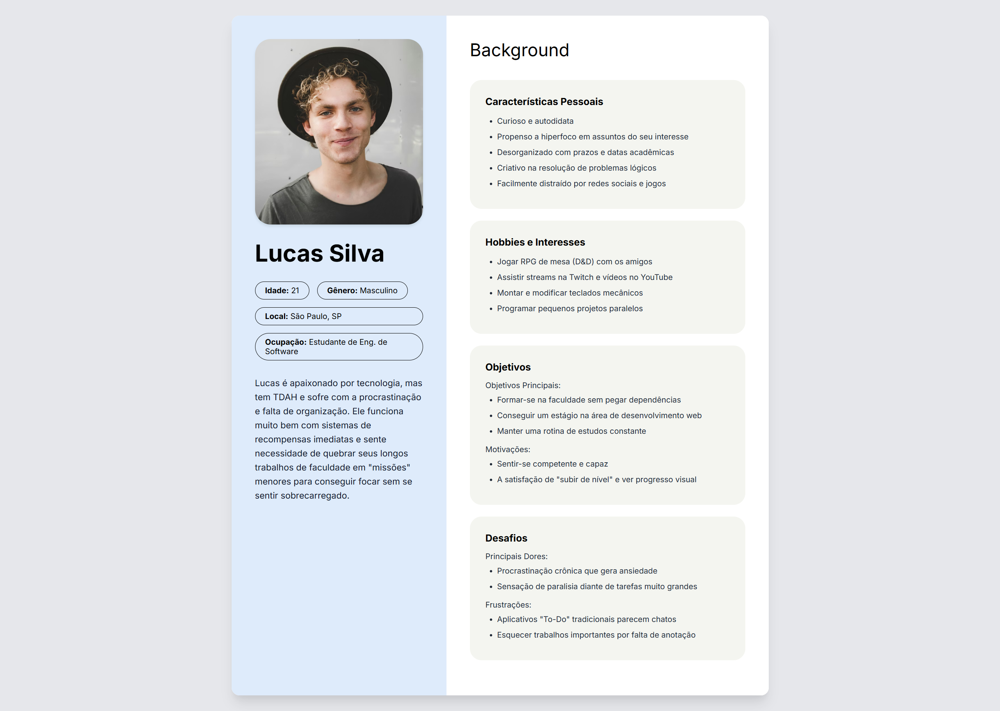

Persona 2: Marina Albuquerque
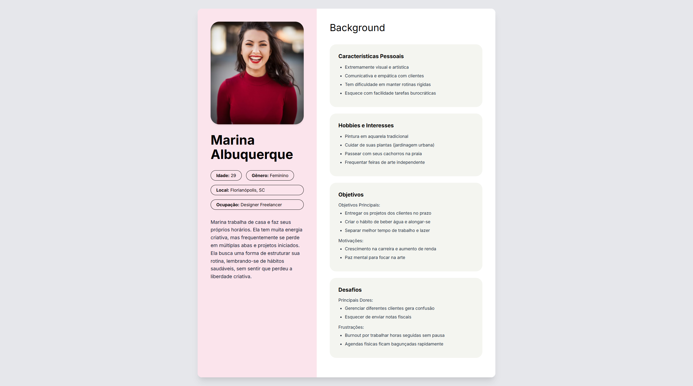

Persona 3: Roberto Mendes
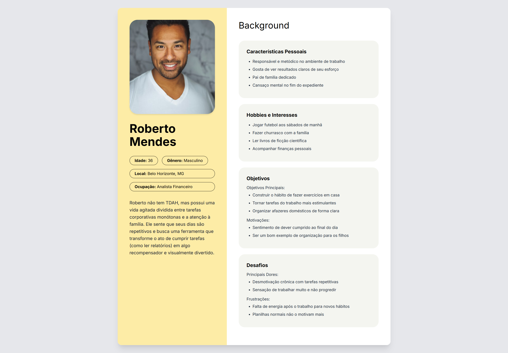

Persona 4: Sara Marques
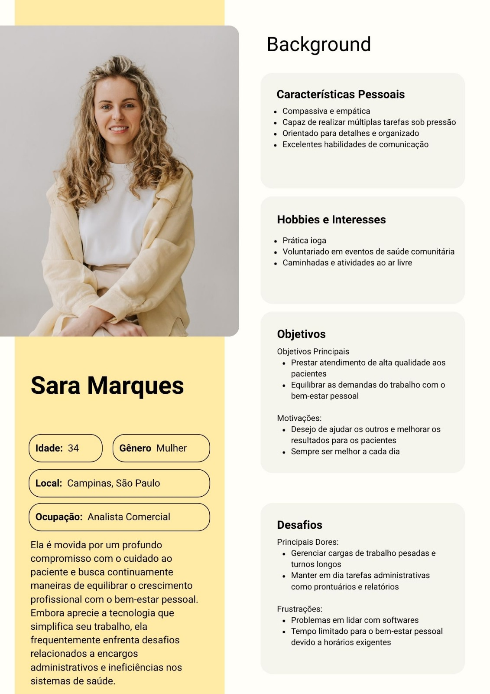

## 4.2 Mapa de Empatia
Mapa da Empatia é um material utilizado para conhecer melhor o seu cliente. A partir do mapa da empatia é possível detalhar a personalidade do cliente e compreendê-la melhor. O objetivo é obter um nível mais profundo de compreensão de uma persona. A seguir um exemplo de template que pode ser usado para o mapa de empatia. Para cada persona deverá ser apresentado o seu respectivo mapa de empatia. Sugere-se a utilização do template apresentado em https://www.rdstation.com/blog/marketing/mapa-da-empatia/.

Mapa de Empatia: Lucas Silva
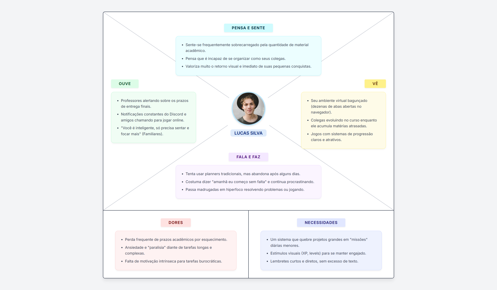

Mapa de Empatia: Marina Albuquerque
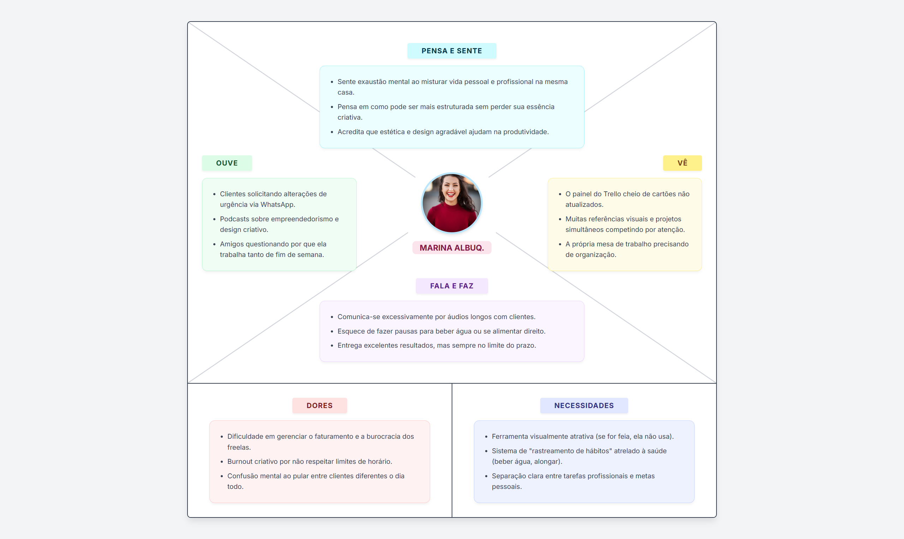

Mapa de Empatia: Roberto Mendes
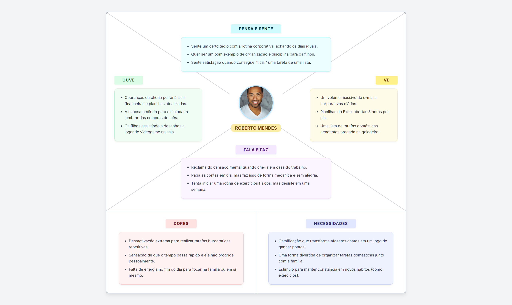

Mapa de Empatia: Sara Marques

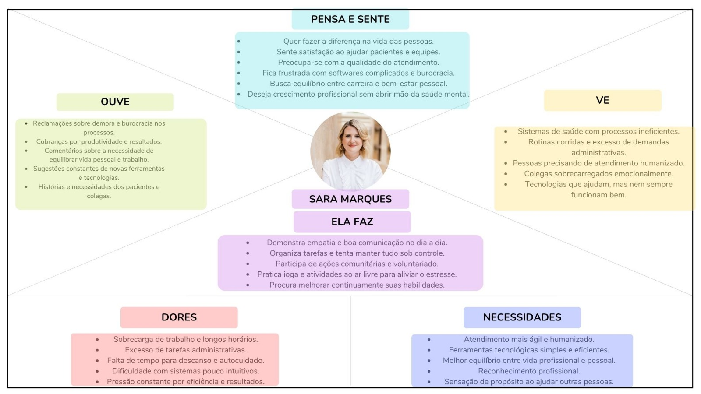

## 4.3 Protótipos das Interfaces
Apresente nesta seção os protótipos de alta fidelidade do sistema proposto. A fidelidade do protótipo refere-se ao nível de detalhes e funcionalidades incorporadas a ele. Assim, um protótipo de alta fidelidade é uma representação interativa do produto, baseada no computador ou em dispositivos móveis. Esse protótipo já apresenta maior semelhança com o design final em termos de detalhes e funcionalidades. No desenvolvimento dos protótipos, devem ser considerados os princípios gestálticos, as recomendações ergonômicas e as regras de design (como as 8 regras de ouro). É importante descrever no texto do relatório como os princípios gestálticos e as regras de ouro foram seguidas no projeto das interfaces. Nesta etapa deve-se dar uma ênfase na implementação do software de modo que possam ser realizados os testes com usuários na etapa seguinte.

4.3.1 Tela de Login: Tela inicial onde o usuário realiza a autenticação na plataforma para acessar seu painel gamificado, possuindo também atalho direto para a criação de uma nova conta.
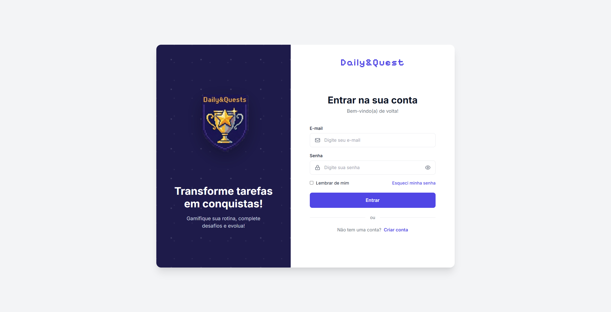

* **Princípios Gestálticos:**
    * **Proximidade:** Campos de e-mail e senha estão agrupados centralmente, facilitando a percepção de que formam o bloco de login.
    * **Similaridade:** Os campos de entrada possuem o mesmo estilo visual, indicando funções idênticas de inserção de texto.
    * **Continuidade:** O fluxo visual é vertical, conduzindo o olhar naturalmente do topo do formulário até o botão de confirmação.
    * **Fechamento:** O container do formulário delimita a área de preenchimento, separando o conteúdo funcional do fundo da página.
    * **Figura-Fundo:** O uso de contraste destaca a caixa de login (figura) sobre o plano de fundo (fundo), eliminando distrações visuais na web.

* **Regras de Ouro de Shneiderman:**
    * **Consistência:** A interface utiliza o padrão de cores e fontes definido no guia de estilo da plataforma web.
    * **Feedback Informativo:** O cursor do mouse muda para "pointer" ao passar sobre botões, sinalizando elementos clicáveis.
    * **Redução da Sobrecarga de Memória:** O layout é simplificado, solicitando apenas dados mínimos para evitar que o usuário precise memorizar instruções complexas.
    * **Reversão de Ações:** Botão de "Voltar" ou links de alternância permitem que o usuário mude de ideia antes de submeter os dados.

* **Recomendações Ergonômicas:**
    * **Carga de Trabalho:** O formulário curto reduz o tempo de digitação e a fadiga visual.
    * **Condução:** O design foca a atenção no centro da tela, onde ocorre a ação principal do navegador.
    * **Controle do Usuário:** Links de fácil acesso permitem que o usuário navegue para outras partes do site caso tenha entrado na página errada.
    * **Consistência:** Ícones universais de login facilitam a compreensão rápida sem necessidade de leitura densa.

4.3.2 Tela de Cadastro: Tela onde o novo usuário preenche seus dados pessoais essenciais para registrar uma conta e iniciar sua jornada de produtividade.
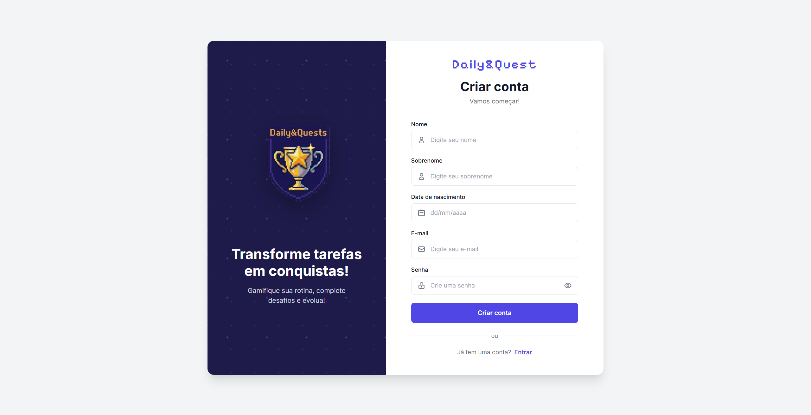

* **Princípios Gestálticos:**
    * **Proximidade:** Etiquetas de texto e campos de entrada estão próximos, garantindo que o usuário saiba exatamente o que preencher.
    * **Similaridade:** Todos os campos de registro seguem o mesmo padrão de design, reforçando a consistência do sistema.
    * **Continuidade:** A disposição dos campos sugere um passo a passo lógico para a criação da conta.
    * **Fechamento:** Bordas nítidas nos inputs ajudam a definir o espaço de clique para o ponteiro do mouse.
    * **Figura-Fundo:** O formulário de registro é o elemento de maior peso visual na página, destacando-se contra o background estilizado.

* **Regras de Ouro de Shneiderman:**
    * **Consistência:** Mantém os mesmos componentes visuais da tela de login para reforçar o aprendizado do usuário no site.
    * **Feedback Informativo:** Validações de formulário indicam erros de preenchimento antes mesmo do envio final.
    * **Redução da Sobrecarga de Memória:** Placeholders dentro dos campos auxiliam o preenchimento sem exigir que o usuário decore o que cada campo pede.
    * **Reversão de Ações:** O usuário pode limpar os campos ou retornar à página anterior através da navegação nativa do navegador.

* **Recomendações Ergonômicas:**
    * **Carga de Trabalho:** Estrutura enxuta para não desencorajar o novo usuário com formulários excessivamente longos.
    * **Condução:** O layout guia o preenchimento de cima para baixo, finalizando no botão de chamada para ação (CTA).
    * **Controle do Usuário:** Oferece opções de visualização de senha para conferência antes da confirmação.
    * **Consistência:** Estética visual alinhada com as demais páginas do ecossistema web do projeto.

4.3.3 Interface principal do sistema organizada em colunas para a gestão de hábitos e tarefas. O diferencial é o sistema de RPG, onde o usuário ganha pontos de experiência (XP) ou recupera vida (HP) ao concluir suas obrigações diárias, transformando a produtividade em um jogo.
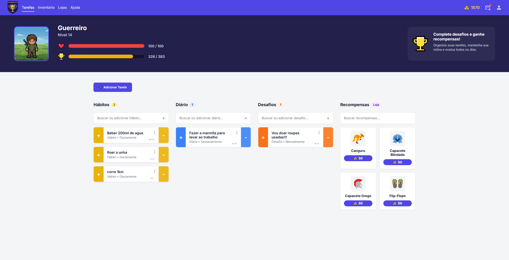

* **Princípios Gestálticos:**
    * **Proximidade:** Tarefas são agrupadas em colunas (Hábitos, Diárias, Metas), organizando o fluxo de trabalho por categorias.
    * **Similaridade:** Cards de tarefas possuem a mesma estrutura visual, permitindo que o usuário identifique o padrão de interação.
    * **Continuidade:** O alinhamento horizontal das colunas incentiva a navegação lateral e o planejamento sequencial.
    * **Fechamento:** Cada card é uma unidade independente, facilitando a distinção entre diferentes obrigações no painel.
    * **Figura-Fundo:** As barras de HP e XP no cabeçalho destacam-se como elementos de status persistentes sobre a área de trabalho.

* **Regras de Ouro de Shneiderman:**
    * **Consistência:** A barra de navegação lateral (menu) permanece fixa, facilitando o acesso a outras áreas da aplicação web.
    * **Feedback Informativo:** Mudanças visuais imediatas nas barras de progresso ao concluir uma tarefa (gamificação em tempo real).
    * **Redução da Sobrecarga de Memória:** O formato Kanban organiza a carga mental, exibindo as tarefas em blocos digeríveis.
    * **Reversão de Ações:** Permite desmarcar tarefas, corrigindo o ganho de experiência ou perda de vida de forma instantânea.

* **Recomendações Ergonômicas:**
    * **Carga de Trabalho:** A divisão da rotina em colunas reduz a sensação de sobrecarga comum em usuários com TDAH.
    * **Condução:** Elementos visuais coloridos (verde, vermelho, amarelo) indicam prioridades e status de saúde do avatar.
    * **Controle do Usuário:** Autonomia para criar, deletar e reordenar tarefas conforme a necessidade individual.
    * **Consistência:** Uso de ícones padrão de jogos que comunicam significado sem depender exclusivamente de texto.

4.3.4 Tela de Inventário: Tela onde são listados os itens e recompensas virtuais adquiridos pelo usuário na loja da plataforma, com opção de filtros laterais por categorias específicas (pets, equipamentos, etc.).
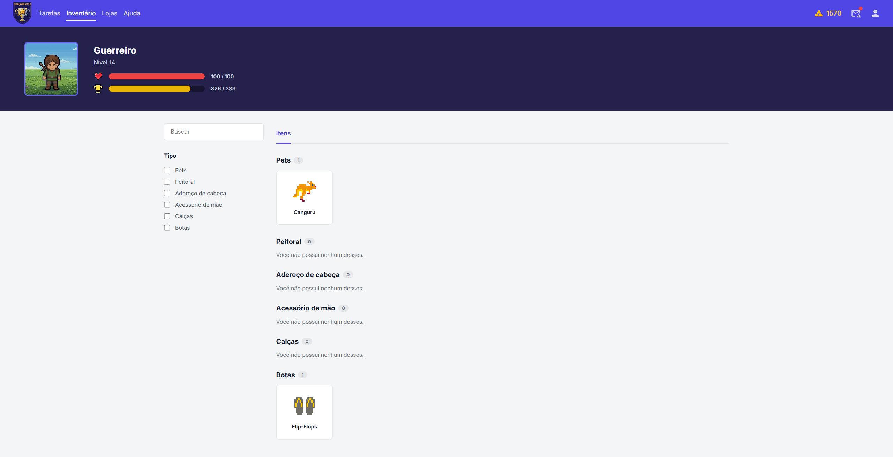

* **Princípios Gestálticos:**
    * **Proximidade:** Os itens colecionáveis são dispostos em grade, permitindo a comparação visual rápida.
    * **Similaridade:** Todos os slots de inventário possuem o mesmo formato, padronizando a exibição das conquistas.
    * **Continuidade:** A grade direciona a varredura visual organizada, típica de sistemas de gerenciamento de arquivos.
    * **Fechamento:** Bordas de cada slot "fecham" a área do item, facilitando a precisão do clique com o mouse.
    * **Figura-Fundo:** O fundo escuro dos slots destaca os ícones dos equipamentos, dando foco ao valor estético das recompensas.

* **Regras de Ouro de Shneiderman:**
    * **Consistência:** A identidade visual dos itens é mantida desde a conquista até a visualização no perfil.
    * **Feedback Informativo:** Realce visual (borda ou brilho) indica qual item está atualmente equipado no personagem.
    * **Redução da Sobrecarga de Memória:** O sistema de filtros (abas laterais) elimina a necessidade de procurar itens em listas longas.
    * **Reversão de Ações:** Permite equipar e trocar acessórios livremente, sem limites de tentativas.

* **Recomendações Ergonômicas:**
    * **Carga de Trabalho:** Organização em categorias que permite ao usuário focar apenas em uma parte do equipamento por vez.
    * **Condução:** Navegação lateral intuitiva que conduz o usuário entre as diferentes classes de itens.
    * **Controle do Usuário:** Oferece gestão completa sobre os itens adquiridos e a estética do avatar.
    * **Consistência:** Mantém os padrões de navegação e menu vistos na Dashboard.

4.3.5 Tela Perfil: Tela funcionando como painel de controle flutuante, onde o usuário edita seus dados de cadastro, ajusta o nome de exibição do seu avatar e acompanha suas estatísticas básicas.
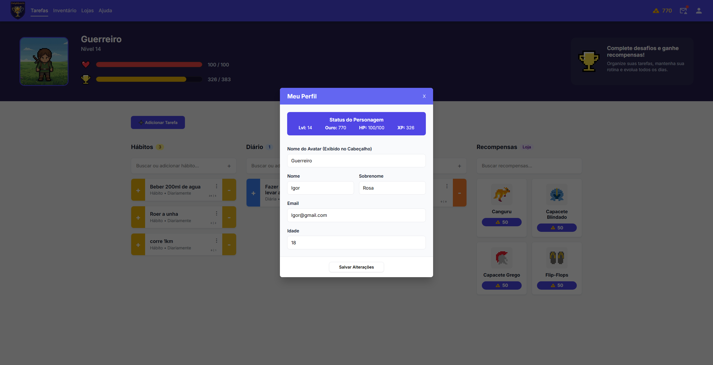

* **Princípios Gestálticos:**
    * **Proximidade:** Informações de usuário e estatísticas de progresso estão agrupadas em seções temáticas claras.
    * **Similaridade:** Elementos de edição (botões e campos) seguem o padrão visual de toda a aplicação web.
    * **Continuidade:** Layout vertical que guia a leitura da imagem do avatar até os dados de performance na base.
    * **Fechamento:** O uso de modais ou seções delimitadas isola as configurações de perfil do restante da interface.
    * **Figura-Fundo:** O avatar centralizado atua como a figura principal, reforçando a identidade pessoal do usuário.

* **Regras de Ouro de Shneiderman:**
    * **Consistência:** Mantém o uso das mesmas cores e fontes de status que o usuário já aprendeu na Dashboard.
    * **Feedback Informativo:** Mensagens de confirmação indicam que as alterações de perfil foram salvas com sucesso no servidor.
    * **Redução da Sobrecarga de Memória:** Exibe apenas métricas fundamentais de progresso, evitando poluição visual com dados secundários.
    * **Reversão de Ações:** Botão de "Cancelar" ou "Fechar" permite sair da tela de edição sem aplicar mudanças indesejadas.

* **Recomendações Ergonômicas:**
    * **Carga de Trabalho:** Interface focada apenas na identidade, livre de elementos de gestão de tarefas.
    * **Condução:** Organização hierárquica que prioriza a imagem do usuário seguida de suas conquistas.
    * **Controle do Usuário:** Liberdade para personalizar a representação digital do usuário no sistema.
    * **Consistência:** Uso de medalhas e ícones de experiência que conversam com a linguagem de RPG do site.

4.3.6 Tela de Loja: Tela onde o usuário pode utilizar suas moedas de ouro, adquiridas ao completar tarefas, para comprar novos itens, equipamentos e pets para personalizar o seu avatar.
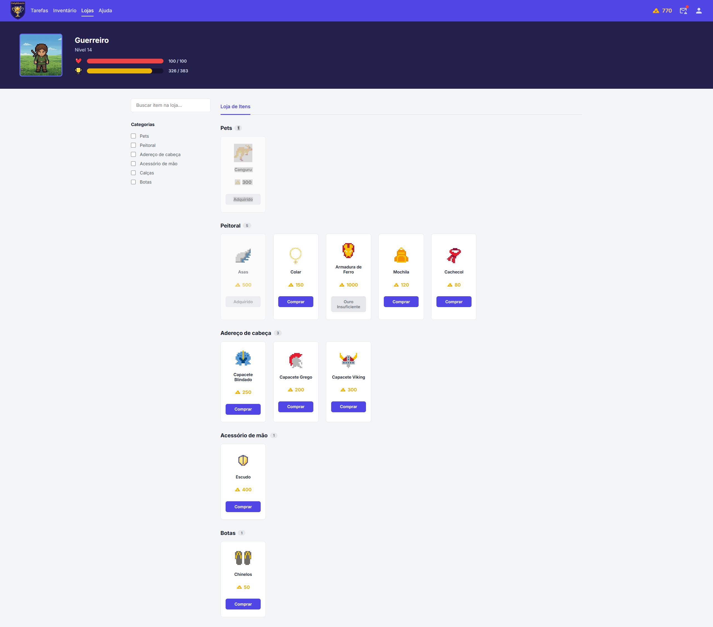

* **Princípios Gestálticos:**
    * **Proximidade:** O preço em ouro está posicionado imediatamente abaixo do ícone de cada item, criando uma associação direta entre o produto e o seu valor.
    * **Similaridade:** Os itens à venda utilizam o mesmo padrão de card, facilitando o reconhecimento instantâneo de que todos são produtos interativos e compráveis.
    * **Continuidade:** A disposição em grade induz o usuário a explorar o catálogo navegando de forma linear, visualizando as opções linha por linha.
    * **Fechamento:** Cada slot de item possui um contorno que agrupa a imagem, o preço e o botão de compra em uma única unidade visual de decisão.
    * **Figura-Fundo:** Itens indisponíveis por falta de saldo ou já adquiridos recebem uma camada de opacidade, mantendo o foco (figura) apenas nos itens que o usuário pode comprar.

* **Regras de Ouro de Shneiderman:**
    * **Consistência:** O layout de grade e os filtros laterais replicam a exata estrutura e identidade visual da tela de Inventário, aproveitando o aprendizado prévio do usuário.
    * **Feedback Informativo:** Os botões mudam de estado dinamicamente (ex: assumindo os textos "Adquirido" ou "Ouro Insuficiente") dependendo do saldo e do inventário do usuário.
    * **Redução da Sobrecarga de Memória:** O saldo atual de ouro fica fixo e bem visível no cabeçalho superior, dispensando a necessidade de o usuário memorizar ou buscar quanto possui.
    * **Reversão de Ações:** Ao clicar em comprar, um modal de confirmação é acionado antes da transação, protegendo o usuário de compras acidentais e impulsivas.

* **Recomendações Ergonômicas:**
    * **Carga de Trabalho:** O menu de filtros laterais permite isolar categorias específicas de itens (como apenas Pets ou Peitorais), evitando a fadiga de analisar uma lista muito longa.
    * **Condução:** O botão principal de compra em destaque e os preços coloridos guiam o olhar direto para as informações essenciais de conversão.
    * **Controle do Usuário:** O usuário tem autonomia total para navegar livremente entre as abas e decidir estrategicamente como investir as recompensas de sua produtividade.
    * **Consistência:** A navegação superior e os padrões de botões de fechamento de modais mantêm a mesma usabilidade encontrada no restante da plataforma.

## 4.4 Testes com Protótipos

Com o objetivo de avaliar a usabilidade, a clareza visual e a experiência de navegação dos protótipos de alta fidelidade do projeto Daily&Quests, foi elaborado um roteiro de entrevista composto por 15 questões abertas. O instrumento foi desenvolvido para orientar a coleta de percepções dos usuários durante a interação com o protótipo, permitindo identificar pontos positivos, dificuldades de uso, problemas de compreensão e possíveis melhorias na interface.

As perguntas foram estruturadas com foco em aspectos relacionados à arquitetura da informação, organização visual, acessibilidade, compreensão da proposta gamificada e facilidade de navegação dentro da plataforma. Além disso, o roteiro busca compreender o nível de autonomia do usuário durante a utilização do sistema, bem como avaliar se os elementos visuais e textuais contribuem de forma eficiente para a experiência geral de uso.

Roteiro de Entrevista:

1 - Quando você bateu o olho na página inicial do protótipo do Daily&Quests pela primeira vez, o propósito e o objetivo principal da plataforma ficaram claros para você de imediato?

2 - Avaliando o layout das telas do Daily&Quests, você achou que o menu principal e os botões de ação estão posicionados de uma forma natural e intuitiva para o seu uso?

3 - Os nomes que escolhemos para as seções do Daily&Quests, como 'Inventário', 'Lojas' e 'Hábitos', fizeram sentido para você dentro da proposta gamificada do projeto?

4 - Durante a sua análise do protótipo do Daily&Quests, você teve facilidade para encontrar áreas específicas, como o seu perfil ou a aba de ajuda?

5 - Observando o fluxo desenhado para criar ou concluir uma tarefa no Daily&Quests, você diria que as etapas seguem uma lógica clara e fácil de entender?

6 - Em relação à paleta de cores e aos ícones do Daily&Quests, esses elementos te ajudaram a identificar rapidamente o que era um botão clicável e o que era apenas um texto informativo?

7 - Olhando para o design do Daily&Quests como um todo, existe algum elemento visual ou card que puxou a sua atenção de forma indevida ou causou alguma confusão?

8 - Os textos e rótulos utilizados nas telas do Daily&Quests te orientaram bem sobre quais ações você poderia realizar em cada página?

9 - Houve algum detalhe no protótipo do Daily&Quests — seja pelo tamanho da fonte, contraste de cores ou formato — que você considerou difícil de visualizar ou de compreender?

10 - Nas áreas de leitura do Daily&Quests, como na tela de Ajuda (FAQ), você achou que as instruções e explicações estão escritas de forma clara e acessível?

11 - Ao explorar as telas do Daily&Quests, você esbarrou em algum termo técnico ou expressão da nossa mecânica de jogos (como HP ou XP) que pareceu confuso no primeiro momento?

12 - Observando o protótipo do Daily&Quests, você se sente confiante para usar a plataforma sozinho no dia a dia, ou acha que precisaria de um tutorial para começar?

13 - Pensando em tudo o que você viu da interface do Daily&Quests, qual foi a funcionalidade ou o detalhe visual que você mais gostou?

14 - Se você pudesse alterar, remover ou adicionar algo para tornar o Daily&Quests perfeito para a sua rotina, o que você mudaria?

15 - Tem mais alguma impressão geral, dúvida ou comentário sobre o protótipo do Daily&Quests que você gostaria de compartilhar comigo?

---
####  Participante 1: Letícia 

Perfil do participante:** Feminino, 19 anos, estudante de Design Gráfico. É altamente visual e se frustra rapidamente com aplicativos feios ou monótonos. Tem problemas com procrastinação nos estudos e nas tarefas de casa. É engajada com a cultura pop, consome muitas redes sociais e ama jogos de simulação e RPG focados em customização (como *Stardew Valley* ou *The Sims*). A maior motivação dela para usar um aplicativo é a capacidade de colecionar itens virtuais e personalizar seu espaço/avatar.

**Respostas do Questionário:**

1- Totalmente! Bati o olho e já vi o avatar e o ouro, percebi na hora que é um *planner* gamificado.

2- Muito intuitivo. A navegação é super fluida e eu não me perdi em nenhum momento. Tudo está a um clique de distância.

3- Fizeram todo o sentido. Eu amei a nomenclatura! Parecia que eu estava entrando em um joguinho, e não numa ferramenta chata de produtividade.

4- Sim, o menu de cima mostra com um sublinhado a página exata em que estou, então pular para a Ajuda ou para a Loja foi super rápido.

5- Super claro. Achei incrível que para criar uma tarefa eu posso definir a dificuldade dela. Faz todo o sentido no contexto do jogo.

6- Com certeza. O contraste do roxo vibrante nos botões principais e o formato dos cards deixam muito óbvio onde eu devo colocar o mouse.

7- Nada me confundiu, mas acho que na aba de loja, poderia ter um aviso de item adquirido para bater olho e saber quais itens já comprei.

8- Guiaram perfeitamente. O fato do botão na loja mudar para "Ouro Insuficiente" quando a gente não tem dinheiro é um detalhe de design excelente.

9- Zero dificuldade. O design é super limpo, as fontes são bonitas e legíveis e os ícones estão num tamanho ótimo.

10- Muito clara. O texto não usa palavras difíceis e responde exatamente o que a gente quer saber de forma rápida.

11- Não, eu jogo bastante RPG, então HP, XP, Avatar e Ouro são praticamente minha segunda língua. Entendi a mecânica de primeira.

12- 100% confiante. Eu já criaria minha conta e passaria meia hora só cadastrando todas as minhas metas e hábitos da semana.

13- A Loja e o meu Avatar! A ideia de que eu só posso comprar roupinhas e pets se eu for produtiva na vida real é genial, eu ia ficar viciada nisso.

14- Eu gostaria de poder personalizar os detalhes do avatar, como cabelo e cor de pele, logo de cara na criação da conta, para ele ficar parecido comigo.

15- O protótipo está lindo! Ele não tem cara de agenda de empresa, tem um apelo visual muito forte que com certeza atrai o público mais jovem universitário.

---
#### Participante 2: Nicolle

**Perfil do participante:** 19 anos, tatuadora iniciante e criadora de conteúdo nas redes sociais. Tem uma rotina onde ainda mora com os pais, gosta de treinar em peles artificiais, pintar quadros e tatuar nos estilos fineline e old school, sempre querendo aprimorar seus trabalhos.

**Respostas do Questionário:**

1- Quando eu bati o olho na página inicial, eu entendi bem rápido que era uma plataforma de produtividade misturada com RPG. O avatar e o sistema de ouro já deixam isso bem claro logo de cara.

2- Achei tudo muito intuitivo. Os botões e menus estão em lugares fáceis de encontrar e eu não me perdi em nenhum momento usando o protótipo.

3- Fez bastante sentido pra mim. “Inventário”, “Lojas” e “Hábitos” combinam muito com a proposta gamificada e deixam tudo mais divertido.

4- Sim, consegui encontrar o perfil e a área de ajuda bem rápido. A navegação parece natural e fácil de entender.

5- Achei o fluxo muito claro. Criar e concluir tarefas parece simples e organizado, sem etapas complicadas.

6- Sim, as cores e os ícones ajudam bastante a identificar o que é clicável. Os botões principais chamam atenção na medida certa.

7- Nada chegou a me confundir, mas alguns cards chamam atenção demais por causa das cores mais fortes, então às vezes eu acabava olhando mais pra eles.

8- Sim, os textos orientam muito bem sobre o que fazer em cada tela. Não fiquei em dúvida sobre nenhuma função.

9- A única coisa que eu mudaria seria aumentar um pouco alguns textos menores, porque no celular talvez fique mais difícil de ler.

10- Achei a FAQ bem clara e objetiva. As explicações são simples e fáceis de entender.

11- Eu já estou acostumada com jogos, então termos como HP e XP foram tranquilos pra mim. Entendi tudo de primeira.

12- Sim, eu conseguiria usar sozinha sem problemas. Mas um tutorial rápido no começo seria legal pra apresentar as funções principais.

13- O que eu mais gostei foi o sistema de avatar e recompensas. A ideia de ganhar itens conforme você completa tarefas dá muito mais motivação.

14- Eu adicionaria mais personalização para o avatar, como opções de cabelo, roupas e cores diferentes, pra deixar mais com a personalidade de cada pessoa.

15- No geral eu achei o protótipo muito bonito e criativo. Ele tem uma identidade visual forte e realmente parece algo que eu usaria no dia a dia.

